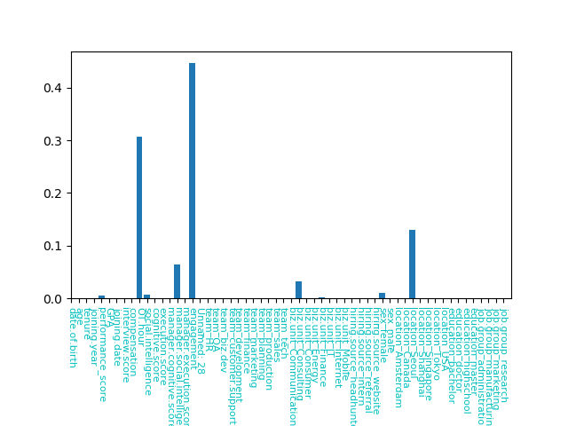
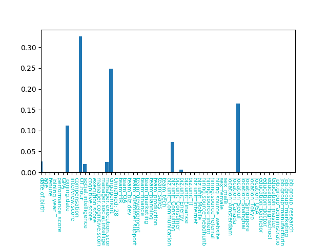
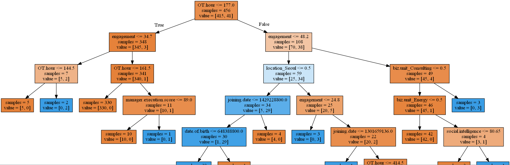
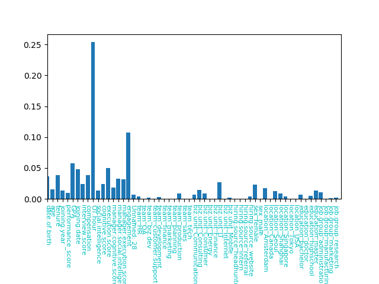
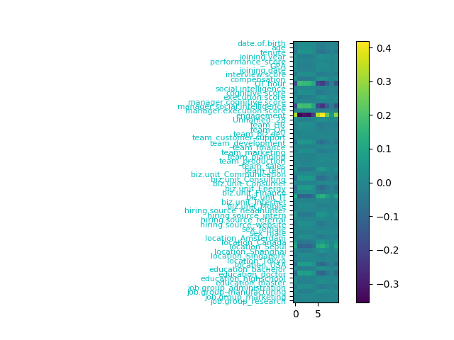
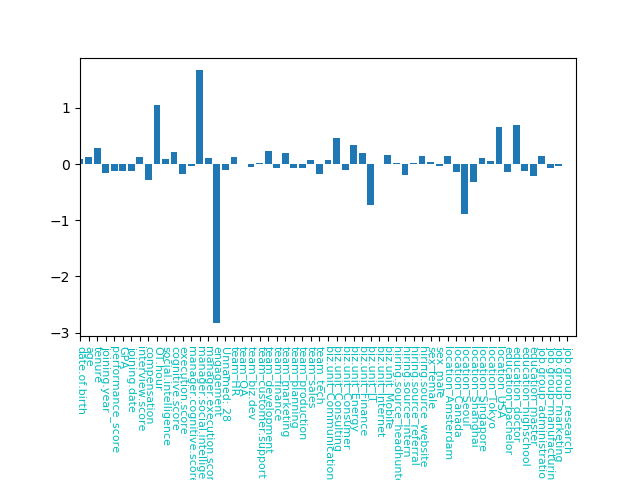

# 課題4

## 実行環境
Windows 7 64bit  
python3.6.4  
numpy :  1.14.1  
matplotlib :  2.1.2  
scikit-learn :  0.19.1  
pandas :  0.22.0  

## 入力データの加工
emp.no , name , termination.date は、入力データから除外  
(理由は、 emp.no , name はユニークな値で, termination.date は退職していないと定義できず、どの値も退職しているかどうかを判断するのには不適だと思ったため)  
その他のデータについては、数値データはそのまま取り込み、職業等の数値ではないものは、 one-hot-encoding を使用している。

## 実行結果
使用したアルゴリズム : 勾配ブースティング  
Training score :  0.9802631578947368  
Test set score :  0.9605263157894737  
(memo 入力データの性質(9割方、退職しない)上うまく分類できなくとも0.9以上の値をとってしまう)

各成分の重要度が出力できるのでプロットすると  
  
図から engagement と OT.huor が重要だと見て取れる。

engagement と OT.huor　を横軸、縦軸にとってプロットすると  
  
図から OT.hour が高く、 engagement が低いと退職している傾向が見える。

## その他のアルゴリズムについて
決定木、ランダムフォレスト、ニューラルネットワーク、ロジスティック回帰、サポートベクターマシン でも同様に分類問題を解いてみた。

###### 決定木  
Training score :  1.0  
Test set score :  0.9671052631578947  
重要度の分布  
  
勾配ブースティングと同様に、engagement と OT.huor が重要だと見て取れる。  
生成された木構造  
  

###### ランダムフォレスト  
Training score :  0.9912280701754386  
Test set score :  0.9342105263157895  
重要度の分布  
  
勾配ブースティングと同様に、engagement と OT.huor が重要だと見て取れる。

###### ニューラルネットワーク  
隠れ層は [10,10,10,10], alpha = 1.0 , 活性化関数は　htan , solver = 'lbfgs' を使用  
Training score :  1.0  
Test set score :  0.9868421052631579  
隠れ層の1層目をプロット  
  
engagement , OT.hour , manager.social.intelligence の係数が特に高い。  
(この分布だけを見て、何が重要かを判断することはできないと思う)

###### ロジスティック回帰  
Training score :  1.0  
Test set score :  0.9868421052631579  
係数の分布  
  
切片は、 -0.92347549  
入力データは全て正のため、 OT.hour、manager.social.intelligence が大きいと退職しやすく、 engagement が大きいと退職しにくいと見て取れる。  
(退職するを 1 , 退職しないを 0 で学習している)

###### サポートベクターマシン
うまく学習できなかった。  
Training score :  1.0  
Test set score :  0.9210526315789473  
